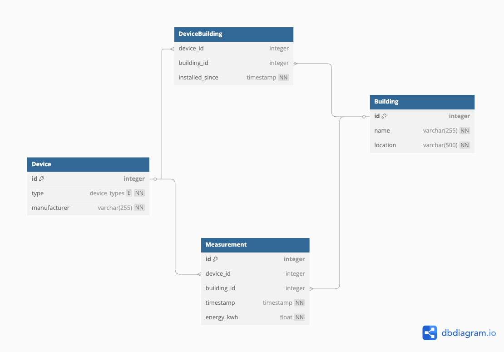

# Energy Management System

A backend system for **energy consumption management** across different buildings. The system enables monitoring of energy consumption measurements, device registration, and connecting devices with buildings.

### Technologies

* **Quarkus** as the backend framework
* **PostgreSQL** as the database
* **GraphQL** for API exposure (CRUDL)
* **Hibernate ORM** for entity mapping
* **Flyway** for database migration management
* **Docker & Docker Compose** for orchestration

### Data Model

1. **Building**
    * Building information (name, location)

2. **Device**
    * Device information (type: HVAC, SOLAR, METER, manufacturer)

3. **Measurement**
    * Energy usage measurements of devices in buildings with timestamps  (device, building, timestamp, value)

4. **DeviceBuilding**
    * Link table connecting devices to buildings with installation date (device, building, installed_since)




## Getting Started

### Prerequisites

- Java 21 or higher
- Maven
- Docker and Docker Compose

Or use the default values in the docker-compose.yml file.

### Running the Application

1. **Build the application**:

```bash
./mvnw package -DskipTests=true 
```

The tests are skipped due to requiring a database which is in the postgres container, they are run later during docker compose.

2. **Start the application with Docker Compose**:

```bash
docker-compose up -d
```

3. **Access the GraphQL UI**:

Open your browser and go to: [http://localhost:8080/q/graphql-ui](http://localhost:8080/q/graphql-ui)

## Technical Details

### Database Configuration

The project uses PostgreSQL with separate databases for development/testing, and production:

- **Production**: `energy_management` - Used in production deployments (is persisted)
- **Testing**: `energy_management_test` - Used for automated tests (is deleted after each reinitialisation)

The Docker Compose setup automatically creates both databases using the initialization script at `src/main/docker/postgres/create-multiple-postgresql-databases.sh`.

Environment variables can be used to customize the database configuration by defining them in an .env file if no -env file is present the defaults are used:
- `DB_USER` - PostgreSQL username (default: postgres)
- `DB_PASSWORD` - PostgreSQL password (default: postgres)
- `DB_NAME` - Main database name (default: energy_management)

### Data Migration

Database schema initialization and updates are managed using Flyway:

- Migration scripts are located in `src/main/resources/db/migration/`
- The initial schema creation is defined in `V1.0.0__Create_tables.sql`
- Migrations run automatically on application startup (`quarkus.flyway.migrate-at-start=true`)

### Application Profiles

The application uses different configurations based on the active profile:

- **dev**: For local development with automatic schema updates
- **test**: Used during automated tests with a clean database for each test
- **prod**: Production settings with connection to the Docker Compose PostgreSQL instance

Profile-specific settings are defined in `src/main/resources/application.properties`.

### Github Actions 

This project also includes a github action that automatically packages and runs the tests, after each push

### Additional Features

* **Input Validation**: The system implements robust validation for all entity attributes to ensure data integrity and consistency.

* **Pagination**: All GraphQL list queries support pagination through `limit` and `offset` parameters, with optional sorting direction through the `orderDirection` parameter.

* **Error Handling**: The GraphQL API implements comprehensive error handling to provide meaningful feedback when operations fail or inputs are invalid.

### GraphQL API

The GraphQL API is implemented using SmallRye GraphQL extension for Quarkus:

- GraphQL schema is auto-generated from Java code
- The UI interface is available at `/q/graphql-ui` when running the application
- All CRUD operations are exposed through GraphQL endpoints

### Entity Relationships

The application implements the following entity relationships:

- One-to-Many: Building → Measurements
- One-to-Many: Device → Measurements
- Many-to-Many: Building ↔ Device (through DeviceBuilding junction table)

### Docker Configuration

The project includes multiple Docker configurations:

- `Dockerfile.jvm`: Standard JVM-based image (used by default)
- `Dockerfile.native`: Native executable image for improved startup and memory usage (not used)
- `Dockerfile.legacy-jar`: Traditional JAR-based deployment (not used)
- `docker-compose.yml`: Orchestrates the application and database containers

### Testing

The project includes comprehensive GraphQL endpoint tests:

- Integration tests use the actual database with test transactions
- Each entity has dedicated test classes (BuildingTests, DeviceTests, etc.)
- Tests verify CRUD operations, validations, and business logic

## GraphQL API

The API provides complete CRUD operations for all entities:

### Example Queries

Here are some example queries you can try in the GraphQL UI:

**Get a Building by ID**
```graphql
query {
  getBuilding(buildingId: 1) {
    id
    name
    location
  }
}
```

**Get Energy Consumption for a Building in a Time Range**
```graphql
query {
  getEnergyConsumptionByBuilding(
    buildingId: 1, 
    from: "2024-04-01T00:00:00Z"", 
    to: "2024-04-07T00:00:00Z"
  )
}
```

**Create a New Device**
```graphql
mutation {
  createDevice(input: {
    type: HVAC
    manufacturer: "Siemens"
  }) {
    id
    type
    manufacturer
  }
}
```

**Add a Measurement**
```graphql
mutation {
  createMeasurement(input: {
    deviceId: 1
    buildingId: 1
    timestamp: "2024-04-01T00:00:00Z"
    energyKwh: 42.5
  }) {
    id
    timestamp
    energyKwh
  }
}
```

**Connect a Device to a Building**
```graphql
mutation {
  createDeviceBuilding(input: {
    deviceId: 1
    buildingId: 1
    installedSince: "2024-04-01T00:00:00Z"
  }) {
    deviceId
    buildingId
    installedSince
  }
}
```

### Queries

- `getBuilding(buildingId: ID!): Building`
- `getAllBuildings(limit: Int, offset: Int, orderDirection: String): [Building]`
- `getDevice(deviceId: ID!): Device`
- `getAllDevices(limit: Int, offset: Int, orderDirection: String): [Device]`
- `getMeasurement(measurementId: ID!): Measurement`
- `getAllMeasurements(limit: Int, offset: Int, orderDirection: String): [Measurement]`
- `getDeviceBuilding(deviceId: ID!, buildingId: ID!): DeviceBuilding`
- `getAllDeviceBuilding(limit: Int, offset: Int, orderDirection: String): [DeviceBuilding]`

### Special Queries

- `getEnergyConsumptionByBuilding(buildingId: ID!, from: Instant, to: Instant): Float`
- `getEnergyConsumptionByDevice(deviceId: ID!, from: Instant, to: Instant): Float`
- `getDevicesByBuilding(buildingId: ID!): [Device]`

### Mutations

- `createBuilding(input: BuildingInput!): Building`
- `updateBuilding(input: BuildingInput!): Building`
- `deleteBuilding(input: BuildingInput!): Boolean`
- `createDevice(input: DeviceInput!): Device`
- `updateDevice(input: DeviceInput!): Device`
- `deleteDevice(input: DeviceInput!): Boolean`
- `createMeasurement(input: MeasurementInput!): Measurement`
- `updateMeasurement(input: MeasurementInput!): Measurement`
- `removeMeasurement(input: MeasurementInput!): Boolean`
- `createDeviceBuilding(input: DeviceBuildingInput!): DeviceBuilding`
- `updateDeviceBuilding(input: DeviceBuildingInput!): DeviceBuilding`
- `deleteDeviceBuilding(input: DeviceBuildingInput!): Boolean`

## Testing

Run the tests with:

```bash
./mvnw test
```

The project includes tests for all GraphQL endpoints with specific tests for edge cases and data validation.

## Project Structure

- `src/main/java/com/example/energy/entity/` - Data model entities
- `src/main/java/com/example/energy/repository/` - Data access layer
- `src/main/java/com/example/energy/service/` - Business logic
- `src/main/java/com/example/energy/graphql/` - GraphQL endpoints
- `src/main/java/com/example/energy/graphql/input/` - GraphQL input DTOs
- `src/main/resources/db/migration/` - Flyway database migrations
- `src/main/docker/` - Docker configuration files
- `src/test/java/com/example/energy/Graphql/` - GraphQL endpoint tests